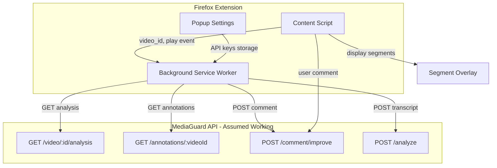

# MediaGuard — Firefox Extension Plan (YouTube)

This plan covers **only** the Firefox extension. The API (Cloudflare Worker + Supabase) is implemented separately and assumed to be working as described in [mediaguard_api_and_database_48140088.plan.md](.cursor/plans/mediaguard_api_and_database_48140088.plan.md).

---

## Architecture




---

## API Contract (from API plan — extension consumes these)


| Endpoint                   | Method | Extension usage                                                                                   |
| -------------------------- | ------ | ------------------------------------------------------------------------------------------------- |
| `/video/:videoId/analysis` | GET    | Fetch analysis on play; send `X-Mistral-API-Key` header when triggering new analysis (cache miss) |
| `/annotations/:videoId`    | GET    | Fetch merged annotations for overlay (user-improved + analysis-derived)                           |
| `/comment/improve`         | POST   | Submit user improvement comment                                                                   |
| `/analyze`                 | POST   | Phase 2: submit client transcript when no captions ( ElevenLabs fallback)                         |


**GET /video/:videoId/analysis** — Success 200:

```json
{
  "video_id": "abc123",
  "alerts": [{ "type", "technique", "quote", "explanation", "severity", "start", "end" }],
  "fact_checks": [{ "claim", "verdict", "context", "sources", "start", "end" }]
}
```

**Error 404:** `{ "reason": "no_transcript" }` or `{ "reason": "analysis_failed" }`

---

## Project Structure

```
media-guard/
├── extension/
│   ├── manifest.json
│   ├── popup/
│   │   ├── popup.html
│   │   ├── popup.js
│   │   └── popup.css
│   ├── content/
│   │   ├── content.js
│   │   └── overlay.css
│   ├── background/
│   │   └── service-worker.js
│   └── lib/
│       └── youtube.js
└── README.md
```

---

## Implementation Phases

### Phase 1: Extension Shell + API Integration

**1.1 Manifest**

- [extension/manifest.json](extension/manifest.json): Manifest V3 (Firefox 109+ supports MV3) or V2 for broader compatibility
- `content_scripts` for `*://www.youtube.com/watch`*
- `permissions`: `storage`, `activeTab`; `host_permissions` for API base URL

**1.2 Popup**

- Input: Mistral API key (BYOK) — stored in `browser.storage.local`
- Optional: API base URL (configurable for dev/prod)
- "Save" stores settings; extension never persists keys on server

**1.3 Background Service Worker**

- Message handler: receive `{ action: "getAnalysis", videoId }` from content script
- Load Mistral key from storage; call `GET /video/{videoId}/analysis` with `X-Mistral-API-Key` header
- On 404 (cache miss): retry with key to trigger backend analysis; backend returns 200 once done
- Return analysis JSON or error to content script
- Similar handlers for `getAnnotations` and `submitComment`

**1.4 lib/youtube.js**

- `getVideoId()`: extract from `window.location.search` or `ytInitialPlayerResponse`
- `getVideoElement()`: `document.querySelector('#movie_player video')` or `#html5-video`
- `getProgressBar()`: `#progress` or `.ytp-progress-bar-container`
- Stable selectors; handle YouTube DOM structure

**1.5 Content Script (minimal)**

- Match YouTube watch page; inject when DOM ready
- Wait for `#movie_player video`, get `video_id` via [extension/lib/youtube.js](extension/lib/youtube.js)
- On `play` event, send message to background: `getAnalysis`
- Show placeholder "Loading analysis..." while pending

---

### Phase 2: Segment Overlay + Display

**2.1 Segment Markers on Progress Bar**

- Parse `alerts` and `fact_checks`; each has `start`/`end` (seconds)
- Append colored bars to YouTube progress bar (similar to SponsorBlock): e.g. orange for manipulation, blue for fact-check
- Use `video.duration` to compute pixel positions: `(start / duration) * 100%`

**2.2 Floating Panel**

- Inject panel into `#ytd-player` or `#secondary`; absolute positioning, `z-index` above controls
- On `video.timeupdate`: check `video.currentTime` against segment `[start, end]`
- When playback enters a segment, show: technique/claim, quote, explanation, severity/verdict, sources (if any)
- Hide when leaving segment

**2.3 Overlay Styling**

- [extension/content/overlay.css](extension/content/overlay.css): segment bars, panel, typography
- Non-intrusive; collapses when not needed

---

### Phase 3: Annotations + Comment UI

**3.1 Fetch Annotations**

- After analysis loads, optionally call `GET /annotations/:videoId` for user-improved segments
- Merge with analysis data: annotations override or augment analysis-derived segments
- Display merged list in overlay

**3.2 Comment UI**

- Each segment in panel has "Add context / Report" button
- Modal or inline form: user types comment, submits
- Background sends `POST /comment/improve`: `{ video_id, annotation_id, timestamp_start, user_comment, current_content }`
- On success, refresh annotations and update overlay

---

### Phase 4: Polish + Edge Cases

- **Error handling**: 404 no_transcript → show "No captions available"; analysis_failed → retry or user message
- **Rate limits**: Display friendly error; suggest retry later
- **YouTube DOM changes**: Use robust selectors; consider MutationObserver if needed
- **No API key**: Popup prompts user; content script shows "Configure Mistral key in extension" when missing

---

## Key Technical Decisions


| Topic             | Decision                                                                                             |
| ----------------- | ---------------------------------------------------------------------------------------------------- |
| Manifest          | MV3 if Firefox target supports it; else MV2                                                          |
| API base URL      | Configurable in popup; default to deployed Worker URL                                                |
| Mistral key       | Stored in `browser.storage.local`; sent in `X-Mistral-API-Key` header only when needed; never logged |
| Segment detection | `video.currentTime` vs `[start, end]` on `timeupdate`                                                |
| Overlay mount     | Append to `#ytd-player` or `#movie_player` parent; absolute positioning                              |


---

## Out of Scope (handled by API plan)

- Supabase schema and migrations
- Cloudflare Worker endpoints
- YouTube transcript fetching (Innertube)
- Mistral integration
- ElevenLabs audio capture (Phase 2 of original plan) — can be added later as separate extension phase

---

## Dependencies

- None beyond Firefox WebExtension APIs: `browser.storage`, `browser.runtime`, `browser.tabs` (if needed)
- No build step required for basic extension; optional bundler (e.g. web-ext) for packaging

