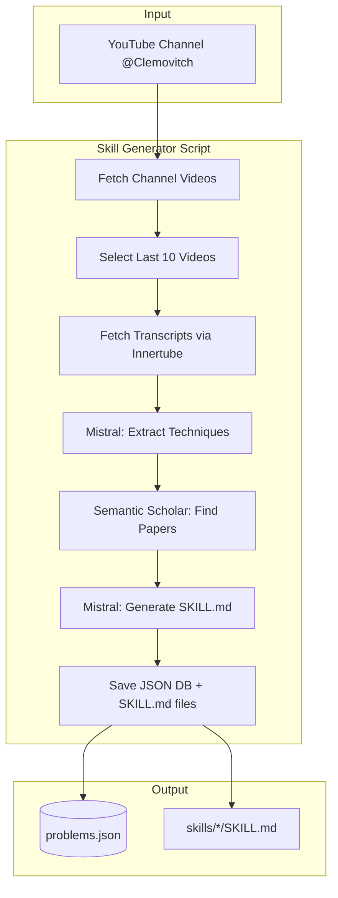

# Skill Generator — YouTube to SKILL.md Pipeline

Standalone Node.js/TypeScript script that ingests Clément Viktorovitch's YouTube channel (@Clemovitch), analyzes transcripts with Mistral, and produces a database of manipulation techniques with research-backed SKILL.md files.

---

## Architecture




---

## Project Structure

```
media-guard/
├── scripts/
│   └── skill-generator/
│       ├── package.json           # deps: youtubei.js, @mistralai/mistralai
│       ├── tsconfig.json
│       ├── .env.example           # MISTRAL_API_KEY, S2_API_KEY (optional)
│       ├── src/
│       │   ├── index.ts           # CLI entry: pnpm run generate
│       │   ├── youtube.ts         # Channel + transcript fetching
│       │   ├── mistral.ts         # Extract techniques + generate SKILL.md
│       │   ├── semantic-scholar.ts # Paper search via REST API
│       │   └── types.ts           # Technique, Problem, SKILL output shapes
│       └── output/
│           ├── problems.json      # Database of problems
│           └── skills/            # One dir per technique
│               └── {slug}/
│                   └── SKILL.md
└── README.md
```

---

## Data Flow

### 1. Fetch Channel Videos

- Use [youtubei.js](https://github.com/LuanRT/YouTube.js) (`youtubei.js` on npm)
- Resolve `@Clemovitch` handle to channel, then browse channel videos (`Innertube` client)
- Sort by upload date, take **last 10**

```ts
import { Innertube } from 'youtubei.js';
const innertube = await Innertube.create();
const channel = await innertube.getChannelByHandle('Clemovitch');
// channel.videos or browse continuation for full list
```

### 2. Fetch Transcripts

- Reuse the Innertube approach from the [API plan](.cursor/plans/mediaguard_api_and_database_48140088.plan.md): `POST youtubei/v1/player` with `videoId` → caption track → parse to `{ text, start, end }[]`
- youtubei.js may expose transcript/caption methods — check `innertube.getBasicInfo(videoId)` or similar
- Fallback: implement custom Innertube caption fetch (same logic as `api/src/lib/youtube-transcript.ts`)
- Concatenate transcripts with video metadata (id, title, url) for Mistral context

### 3. Mistral — Extract Techniques

**Prompt**: Analyze transcript excerpts. Extract manipulation techniques, rhetorical tricks, media/politician tactics. Output structured JSON:

```ts
// types.ts
interface ExtractedTechnique {
  name: string;           // e.g. "Appel à la peur"
  slug: string;           // URL-safe identifier
  description: string;
  examples: { quote: string; videoId: string; context?: string }[];
  category: 'rhetoric' | 'bias' | 'factual' | 'framing' | 'other';
}
```

- Use Mistral `response_format` with Zod schema for reliable parsing
- Model: `mistral-small-latest` or `mistral-large-latest`

### 4. Semantic Scholar — Find Papers

- REST API: `GET https://api.semanticscholar.org/graph/v1/paper/search?query={technique name + "propaganda" or "manipulation"}&limit=5`
- No API key required (rate-limited); optional key for higher limits
- Store: `paperId`, `title`, `url`, `year`, `abstract` (or snippet)
- Query per extracted technique

### 5. Mistral — Generate SKILL.md

**Prompt**: Given technique + paper abstracts, generate a Cursor SKILL.md:

- Frontmatter: `name`, `description` (per [create-skill](~/.cursor/skills-cursor/create-skill/SKILL.md) format)
- Sections: What the technique is, how to recognize it, examples from videos, research backing (citations)
- Concise, under 500 lines, third-person description

Output path: `output/skills/{slug}/SKILL.md`

### 6. Save Database

**problems.json** schema:

```json
{
  "generatedAt": "ISO8601",
  "channel": { "handle": "@Clemovitch", "name": "Clément Viktorovitch" },
  "videosProcessed": ["videoId1", ...],
  "techniques": [
    {
      "slug": "appel-a-la-peur",
      "name": "Appel à la peur",
      "description": "...",
      "category": "rhetoric",
      "examples": [...],
      "sources": [{ "paperId": "...", "title": "...", "url": "..." }],
      "skillPath": "skills/appel-a-la-peur/SKILL.md"
    }
  ]
}
```

---

## Implementation Order

1. **Scaffold** `scripts/skill-generator/` with `package.json`, `tsconfig.json`, `.env.example`
2. **youtube.ts** — Channel resolution + video list + transcript fetch (youtubei.js or custom Innertube)
3. **types.ts** — Zod schemas + TypeScript interfaces
4. **semantic-scholar.ts** — Paper search via `fetch`
5. **mistral.ts** — Extract techniques (structured output) + generate SKILL.md
6. **index.ts** — Orchestrate: fetch → extract → search → generate → write
7. **CLI** — `pnpm run generate` (or `npx tsx src/index.ts`), configurable `--last N` (default 10)

---

## Environment

- `MISTRAL_API_KEY` — Required for Mistral
- `S2_API_KEY` — Optional; improves Semantic Scholar rate limits

---

## Key Libraries


| Purpose          | Library                 |
| ---------------- | ----------------------- |
| YouTube          | `youtubei.js`           |
| Mistral          | `@mistralai/mistralai`  |
| Semantic Scholar | `fetch` (no extra deps) |
| Validation       | `zod`                   |
| Runtime          | `tsx` for execution     |


---

## Risks and Mitigations

- **Innertube instability** — youtubei.js abstracts it; if transcript fails, skip video and log
- **Mistral token limits** — Process transcripts in chunks or summarize long ones before extraction
- **S2 rate limits** — 100 req/sec unauthenticated; add delay between technique queries if needed
- **French content** — Mistral supports French; prompts can be in French or English

---

## Out of Scope

- Integration with MediaGuard API/Prisma (standalone only)
- Firefox extension consumption of this DB (future)
- Real-time or incremental updates (batch script only)

